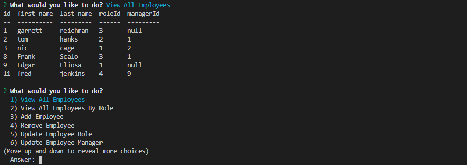

# employee-tracker
by: Garrett Reichman

## Description
This program was made to build my experience with many different sql queries. It uses inquirer to prompt the user for answers then uses the mysql package to display and change items in the database.

## Usage

To use this app, run the command "node tracker.js". Once the application begins, you may use the arrow keys to look through the list of commands and hit enter to select one. Each command will either display the requested results, or make changes to the database based on your input. To exit the application, choose the "Exit" option from the main list.

